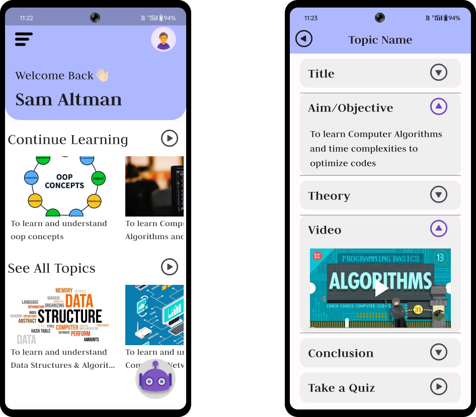
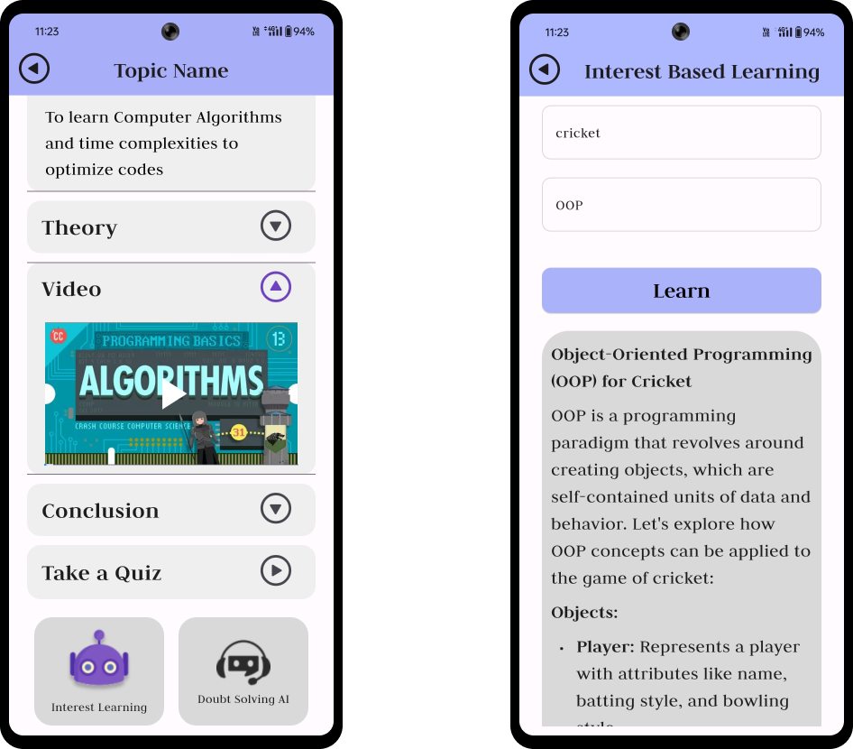
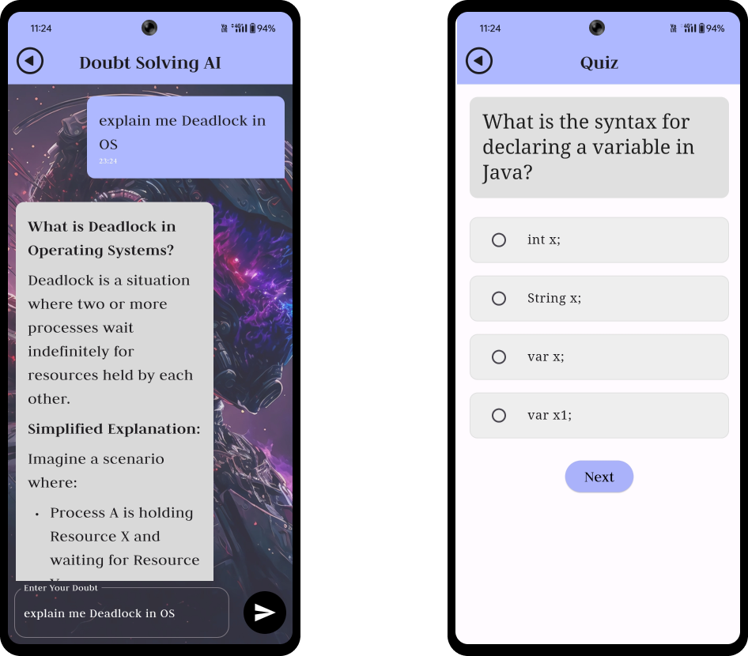
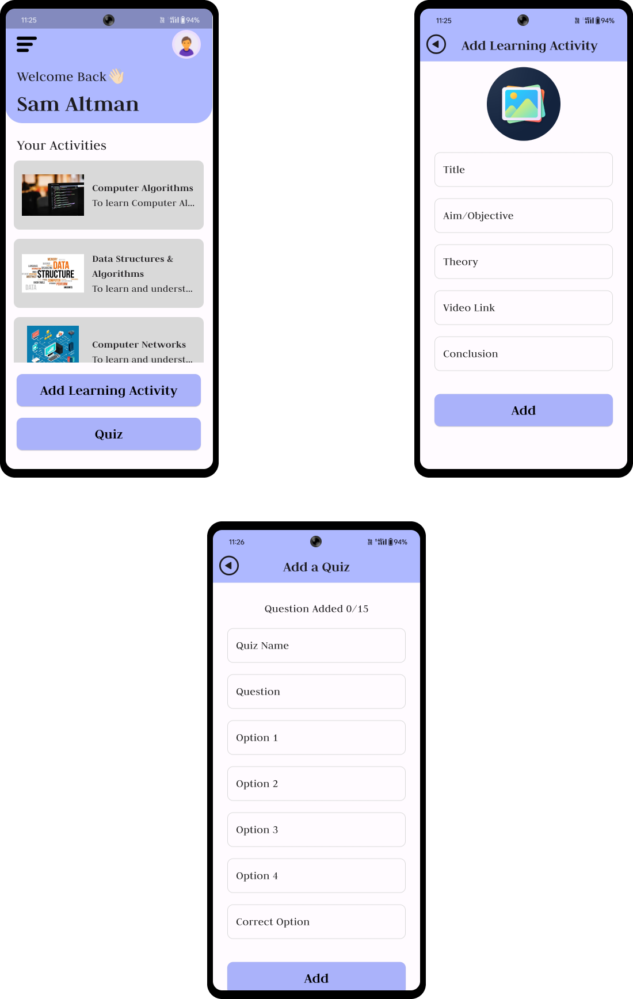

AI Learner
Welcome to the AI Learner project!
This project aims to create an engaging and personalized learning environment for students and a guided activity created by the teacher for a structured path. Utilizing Flutter, Firebase, and Spring Boot, we've developed a platform that enhances educational experiences through advanced features and modern technologies.

Features
Learning from Activities: The teacher can create learning activities with quizzes for students to learn and follow a structured path. The Learning Activity contains the title, aim, theory, video, conclusion and quiz.

Interest-based Learning: Implemented using Gemini AI to tailor learning materials according to students' interests. example: if a student is interested in OOP then AI will teach the student using his interest which will help him depth understanding.

Personalized Learning: Facilitates better engagement by offering content personalized to each student's learning preferences.

Tech Stack
Flutter: Ensure a smooth and interactive user experience for front-end development.

Firebase: Provides robust backend services such as authentication.

Spring Boot: Powers the server-side application, enabling efficient and scalable backend processing.

Screenshots

Teacher View

Login and 

Flow

Student View

Attempt Learning Activity:Engage with learning materials created by teachers

Taking the Quiz: Assess understanding through quizzes

Generating Examples Based on Interest: Receive personalized examples to enhance understanding

Doubt Solving AI Bot:Ask questions and receive answers from an AI bot
Example query: "Explain OOP in terms of Cricket" Example response: "Players, ball, and field are objects; each has specific attributes (e.g., player's name, ball's position) and behaviors (e.g., player's batting, ball's movement)."

Teacher View
Creating the Learning Activity:
Add a Title
Set Aim/Objectives
Provide Theory
Attach Videos
Write Conclusions

Monitoring Learning Process:
Track student progress through quizzes.

Installation
Prerequisites

Flutter SDK
Firebase account
Spring Boot setup
Steps
Clone the Repository git clone https://github.com/RiteshBakare/AI-Learner.git

cd AILearnerStudent

flutter pub get

Create a Firebase account paste the google-services.json file in AILearnerStudent/android/app and enable Firebase auth

flutter run

cd AILearnerTeacher

flutter pub get

flutter run

cd Al-Learner-Backend

./mvnw spring-boot:run 

Contributing
We welcome contributions! Please follow these steps:

Fork the repository.

Create a new branch (git checkout -b feature/your-feature).

Commit your changes (git commit -m 'Add some feature').

Push to the branch (git push origin feature/your-feature).

Open a pull request.

Thank you for checking out our project! We hope you find it useful and engaging. If you have any questions or feedback, please feel free to reach out. Happy learning!
Stay connected and keep learning! 🚀
